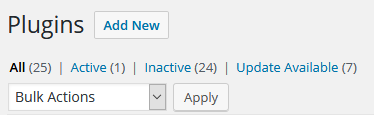
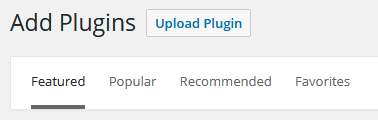
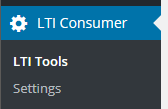

## WordPress LTI Consumer Plugin
A very small and simple plugin that will turn your WordPress site into an [LTI Consumer](https://www.imsglobal.org/activity/learning-tools-interoperability). 

### Installation

This may install a bit differently than you're used to since it's not coming from the WordPress plugins library. You'll need to download a zip file and install it manually. 

First, grab the most recent zip file from [Releases](https://github.com/ClassCube/wordpress-lti-consumer/releases) and download it to your computer. 

Login to your WordPress site and go to the Plugins menu. You're looking for the Add button.

After you click Add you'll bounce to the list of plugins that you can install. Normally you'd search for a plugin in the library and install it that way. But this time you'll need to click on the Upload Plugin button.

And then you'll go to a screen where you can upload the zip file. Go ahead and upload it. Then you'll be able to active this plugin just like any other.

### Settings

Once installed and activated you should see a new menu item labeled LTI Consumer.

Click on the Settings option so we can get a few things setup. You should see
something like this.

The first three options are defaults for new tools, but can be overridden when
you create a new tool.

| Setting          | Notes                                    |
| ---------------- | ---------------------------------------- |
| Share Email      | If enabled the user's email address will be sent as part of the LTI launch request. Depending on the tool, this may be necessary. Or, depending on the privacy rules that you're under you may need to leave this unchecked. |
| Share Username   | If enabled the user's name will be sent as part of the LTI launch request. Same notes on privacy as above. |
| Require Login    | If checked the plugin will only work if the user is logged in to your WordPress site. If not checked the tool will launch for all visitors.  If a user is not logged in it's treated as an anonymous launch so email addresses and usernames will not be sent regardless of the settings above. |
| CSS Class        | If specified the iframe that's inserted will have this CSS class applied. There'snot any CSS loaded with this plugin. You'll still need to edit the CSS for yoursite for this to change how the plugin looks. |
| CSS Style        | Anything here will be added to the style attribute on the iframe that's inserted. |
| Allow Fullscreen | If checked the `allowfullscreen` attribute will be added to the iframe so that the LTI tool can trigger a full screen view.  This doesn't always work though. It's dependent on your browser security settingsand whether you're loading the tool from a different domain. |

### Adding a Tool

Next let's click on the LTI Tools menu option. You should see a page similar to
this, although yours will be blank since you haven't added any tools.

Click on the Add New Tool button on the top of the page and you'll go to a page
where you can create your first tool.

| Settings          | Notes                                    |
| ----------------- | ---------------------------------------- |
| Tool Name         | This is a name that you want to use to describe the tool. It can be anything you want |
| Base URL          | This need to match the beginning of the URL that you'll use to launch the LTI tool.   It's important that you get this right. It's how the plugin knows what tool you're trying to launch. |
| Customer Key      | The Customer Key and Shared Secret work together to validate your launch with the tool provider. These are values that you'll get from your account on your LTI tool provider. As an example, if you're using ClassCube it's under your [user settings](https://classcube.com/documentation/lti-apps/create-key/).   It's also possible that you can leave these blank if your tool doesn't require authentication. |
| Shared Secret     |                                          |
| Custom Parameters | If the LTI tool has either required or optional custom parameters, enter them here, one per line. See your tool documentation for more information. |
| Require Login     | Whether your visitor has to be logged in to your WordPress site for the tool to launch. |
| Share Username    | If enabled, your visitors name will be shared with the LTI tool. This requires that they be logged in. |
| Share Email       | If enabled, your visitors email address will be shared with the LTI tool. This requires that they are logged in to your WordPress site. |

### Inserting a tool on a page

Once you've setup your tool, you can use a shortcode to insert that tool onto a page or post.

You're going to use the `[lti]` shortcode along with a `url` parameter. For example, if your LTI launch URL is `https://example.com/lti-launch.php` you would put the shortcode `[lti url=https://example.com/lti-launch.php]` into the post body.  

Here's a list of the shortcode parameters you can use. Only `url` is required

| Parameter          | Description                                                  |
| ------------------ | ------------------------------------------------------------ |
| `allow_fullscreen` | If set to 1 then your visitor can go fullscreen with the iframe content. If 0, then they cannot. This is done by including the `allowfullscreen` attribute in the iframe. |
| `css_class`        | If present, this will be inserted into the `class` attribute on the iframe.  No default. |
| `css_style`        | If present, this will be inserted into the `style` attribute on the iframe. Defaults to `border:none;width:100%;height:400px;`, but can be overridden globally on the settings page. |
| `url`              | Launch URL for the LTI tool. This is the only required attribute. |

### Help & Support

If you find a bug or have a feature request please [open up an issue on GitHub](https://github.com/ClassCube/wordpress-lti-consumer/issues). This was built primarily for ClassCube users to embed problems into their WordPress sites, so most of our testing was focused there. But this is something that we want to work with any LTI provider. 

If you're having trouble using the plugin, please visit our [support forum](https://classcube.com/forums/) and start a thread. We like to talk. 

If you'd like to learn more about ClassCube visit [ClassCube.com](https://classcube.com). And if you're a teacher take a look at [Why Teach with ClassCube](https://classcube.com/why-teach-with-classcube/).

### Follow Us

In to social media? We're there.

 

