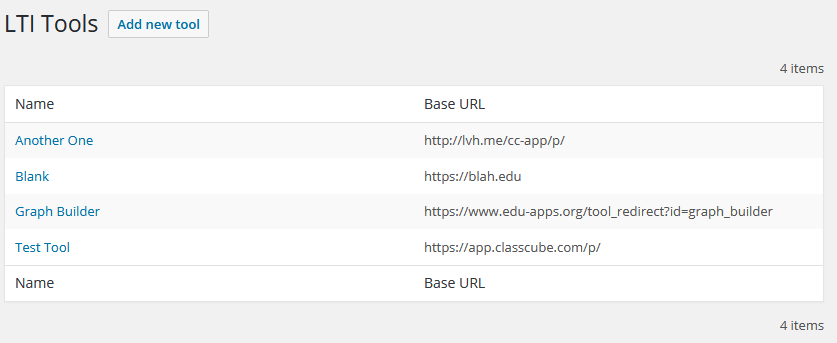

## WordPress LTI Consumer Plugin
This will eventually be a plugin for WordPress that will let you turn your
WordPress site into an LTI Consumer.

For now, it's not totally working so you're probably going to want to hang
on just a bit before downloading and giving it a try. You could go ahead and
click the Star icon and keep up to date. 

### Installation

### Settings
Once installed and activated you should see a new menu item labeled LTI Consumer.

Click on the Settings option so we can get a few things setup. You should see
something like this.

The first three options are defaults for new tools, but can be overridden when
you create a new tool.

**Share Email / Share Name**

If these are enabled then the email or name (or both) will be shared with the
LTI provider. This may be necessary depending on the tool. Or, you may have
to leave it unchecked depending on the privacy rules you're working under.

**Require Login**

If enabled, your visitors must be logged in to your WordPress site for the LTI
tool to launch. 

If you leave this disabled and the visitor is not logged into your site when
they launch then it's treated like an anonymous launch without username and 
email address.

#### Frame Settings
These are settings that determine how the launched tool looks on your site. It's
loaded into an iframe on your post or page.

**CSS Class**

If specified the iframe that's inserted will have this CSS class applied. There's
not any CSS loaded with this plugin. You'll still need to edit the CSS for your
site for this to change how the plugin looks.

**CSS Style**

Anything here will be added to the style attribute on the iframe that's inserted.

**Allow Fullscreen**

If checked the `allowfullscreen` attribute will be added to the iframe so that
the LTI tool can trigger a full screen view.

This doesn't always work though. It's dependent on your browser security settings
and whether you're loading the tool from a different domain. 

### Adding a Tool

Next let's click on the LTI Tools menu option. You should see a page similar to
this, although yours will be blank since you haven't added any tools.

Click on the Add New Tool button on the top of the page and you'll go to a page
where you can create your first tool.

| Settings          | Notes                                    |
| ----------------- | ---------------------------------------- |
| Tool Name         | This is a name that you want to use to describe the tool. It can be anything you want |
| Base URL          | This need to match the beginning of the URL that you'll use to launch the LTI tool. It's important that you get this right. It's how the plugin knows what tool you're trying to launch. |
| Customer Key      |                                          |
| Shared Secret     |                                          |
| Custom Parameters |                                          |
| Require Login     |                                          |
| Share Username    |                                          |
| Share Email       |                                          |

### Follow Us
Like social media? We're there.

 

